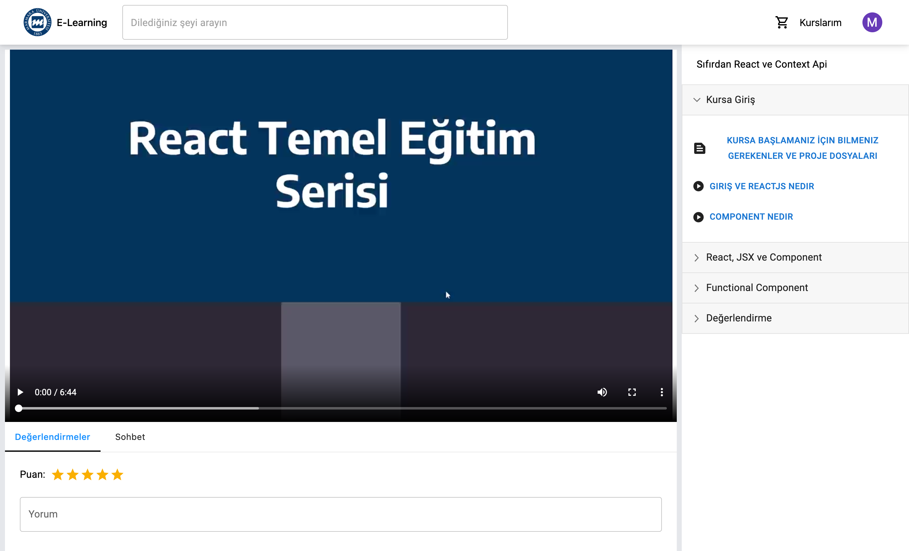

# Bulut Bilişim Tabanlı E-Öğrenme Sitesi

## Projenin Amacı
Günümüz dünyasında sürekli artan kendini geliştirme ve yenileme gereksiniminden dolayı modern bir öğrenme platformuna ihtiyaç duyuluyor. Platformumuzu herhangi bir alanda kendini geliştirmek veya yeni bir şey öğrenmek isteyen kullanıcılar örgün öğretimden farklı olarak zaman, mekan ve cihaz farketmeksizin ulaşabilecekler ve eğitimlerine ara vermeden devam edebilecekler.
 
E-öğrenme; internet teknolojileri aracılığıyla gerçekleştirilen web tabanlı eğitim, öğrenim ve bilgi yönetimi faaliyetleridir. E-öğrenme ile kurumların ve çalışanların hayatı kolaylaşıyor. Kurumların iç eğitim süreçlerini kolaylaştırıyor, dinamik kurum kültürünü destekliyor. Eğitimlere her yerden, sadece internet bağlantısıyla ulaşılabilir, fiziksel bir ortam gerektirmez. Eğitimlerin belli bir zaman aralığında yapılma zorunluluğu yoktur. Eğitimci ile çalışanların aynı ortamda ve aynı anda bulunma zorunluluğunu ortadan kaldırır. Kuruma özel kurulan bir platformla, kurum içinde dinamik bir bilgi akışı sağlar ve bilgi bireylere tek tek ulaşır.

## Proje Mimarisi

    

## Proje Fonksiyonları
### Giriş Ekranı

    

### Kurs Ekranı

    

### Kurs Oluşturma

    

### Mobil Giriş Ekranı

    

### Mobil Kurs Ekranı

    

